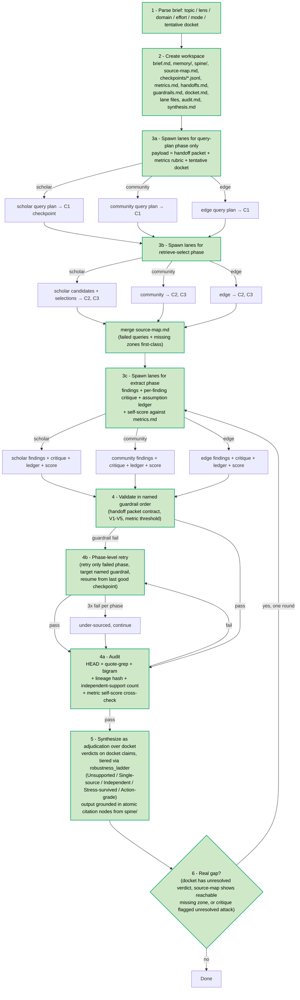

Parent: ARCHITECTURE.md
Supersedes: ./2026-05-19-variations-synthesis-plan.md

# reTruth — Variations Synthesis & Improvement Plan v2

## Status

Replaces v1. User rejected the v1 mode-kit router on the principle "is the original better" — topic-class partitioning sacrifices flexibility for marginal specialization, and real briefs rarely fit one class cleanly. 7 new variations have since landed (v44–v50). The new variations are *runtime/agent-infrastructure* upgrades, not topic specializers, and they fit naturally into a flexibility-preserving universal upgrade path. v2 drops kit routing entirely and presents a single 4-phase universal upgrade.

## Scope

- **Source read:** prior v1 inputs + 7 new directory builds (`retrieval_mesh_v44`, `checkpoint_cascade_v45`, `evaluator_forge_v46`, `handoff_guardrail_swarm_v47`, `memory_citation_spine_v48`, `critique_revision_loop_v49`, `consensus_court_v50`).
- **Decision principle now applied to every recommendation:** "is the original better?" If a candidate addition partitions the pipeline, sacrifices universality, or pre-commits the system to a topic class, it is rejected.
- **Out of scope this turn:** editing `SKILL.md`, lane mandates, `ARCHITECTURE.md`, `CLAUDE.md`. Awaiting user direction.

## Evidence

### Why the prior v1 recommendation was wrong

The mode-kit router (v1 Option B) partitioned topics into 6 classes and selected one kit per run. That trade-off was wrong:

- **Topics are multi-class.** "Is X real?" is hype + mechanism + decision simultaneously; forcing a single kit drops two of three lenses.
- **Classifier failure mode is structural.** Even with confidence thresholds, misclassification → systematic blind spots that the user cannot easily see.
- **Flexibility lives at the gate layer, not the architecture layer.** The original three-lane G0–G9 gate stack already adapts per topic at the per-finding level. Adding kits adds layers without raising the floor.
- **Late-iteration convergence ≠ correct direction.** v1 over-weighted "what the prior agent kept iterating on" without asking whether that iteration path was itself converging on something universal or on something narrow. v44–v50 settle this: when the prior agent kept iterating, it actually shifted *away* from topic-domain mechanisms toward universal agent-runtime mechanisms.

### What v44–v50 add (all universal, all additive)

| # | Variation | What it adds | Universal? |
|---|---|---|---|
| v44 | **retrieval_mesh** | Splits lane work into a *source-map pass* and a *deep-read pass*. Failed queries and missing zones become first-class outputs in `source-map.md`. | Yes — every topic benefits from seeing its own ignorance. |
| v45 | **checkpoint_cascade** | JSONL phase checkpoints (`C1_query_plan`, `C2_source_candidates`, `C3_selected_sources`, then findings). Retry the failed phase, not the whole lane. | Yes — every topic benefits from surgical retry. |
| v46 | **evaluator_forge** | Shared `metrics.md` rubric written *before* lane search. Lanes self-score on retrieval breadth, source precision, quote strength, claim novelty, lane fit, synthesis utility. Below threshold → repair pass on weakest metric. | Yes — quality bar that doesn't depend on topic. |
| v47 | **handoff_guardrail_swarm** | One handoff packet per lane = compact contract (target, search routes, required source types, output contract, named guardrails, retry budget). Validator failures cite the named guardrail. | Yes — every lane benefits from explicit contracts and named failures. |
| v48 | **memory_citation_spine** | Workspace gains `memory/` (queries attempted, candidates considered, rejected sources, absences, patterns, gaps) and `spine/` (atomic citation nodes with claim/lane/source/quote/utility/confidence). Synthesis grounded in atomic units, not bulky lane prose. | Yes — atomic citation nodes work for every topic. |
| v49 | **critique_revision_loop** | Each lane writes a critique entry per finding (strongest attack, evidence weakness, redundancy risk, misclassification risk, revision action) and then revises (keep/revise/demote/drop) — *before* orchestrator audit. | Yes — pushes adversarial pressure into the lane while it still remembers why the source was chosen. |
| v50 | **consensus_court** | Synthesis = explicit adjudication. Tentative docket of claims under review is written *before* lane search. Lanes tag findings with docket claim + conflict risk + consensus potential. Synthesis is verdicts over the docket, not freeform prose. | Yes — every topic has contested vs robust claims; this makes the structure visible. |

All seven are orthogonal to topic. They upgrade the *runtime* and *output structure* universally.

### Compatibility with the still-good ideas from v1

The v1 "always-on baseline" (assumption_ledger field, robustness_ladder synthesis tiers, provenance_chain + evidence_compression_index audit) survives — these are also universal. Everything else from v1 (the 6 kits) is dropped.

## Universal upgrade path — 4 phases

Each phase is independently shippable. No phase locks in a later phase. No phase narrows the topic surface.

### Phase 1 — Surgical retry + visibility into ignorance

**Adds:** `retrieval_mesh` phase split + `checkpoint_cascade` JSONL checkpoints + phase-level retry.

**Why first:** Addresses the most user-visible failure mode in the current pipeline — a whole lane retries on any V1–V5 fail, burning budget on already-validated work. Also makes failed queries and missing source zones visible instead of invisibly absent.

**Files touched:**
- `reTruth/skills/SKILL.md` — Step 3 split into 3 sub-steps (query-plan / retrieve-select / extract). Step 4b retry becomes phase-level. `~40L net add`.
- Each lane mandate — adds 1-section header describing the 3-phase contract. `~5L each`.

**Reversibility:** Revert SKILL.md changes; lanes still function (3-phase contract collapses to original single-pass).

### Phase 2 — Explicit contracts + named failures + memory spine

**Adds:** `handoff_guardrail_swarm` packet + `evaluator_forge` rubric + `memory_citation_spine` workspace layout.

**Why second:** Phase 1 produces phase-level state. Phase 2 makes that state human-auditable and quality-graded. Handoff packets give every lane an explicit contract; metric rubric written before search lets lanes self-score; memory/spine workspace separates "what we tried" from "what we kept."

**Files touched:**
- `reTruth/skills/SKILL.md` — Step 2 workspace layout extended (`memory/`, `spine/`, `metrics.md`, `handoffs.md`, `guardrails.md`). Step 3 spawn payload extended with handoff packet + metrics rubric. Step 4 validation runs in named-guardrail order. `~50L net add`.
- Each lane mandate — adds self-score table at end (6 metric rows). `~10L each`.

**Reversibility:** Delete the new workspace sub-paths; spawn payload returns to current minimum.

### Phase 3 — Per-finding rigor

**Adds:** `assumption_ledger` field + `critique_revision_loop` per-finding critique.

**Why third:** Phases 1+2 give every finding a richer surrounding context (selected-source ID, named guardrail, metric score). Phase 3 raises the rigor at the smallest unit — each finding now declares what must be true (ledger) and survives a same-lane attack (critique).

**Files touched:**
- Each lane mandate — finding format gains `Assumption ledger:` and `Critique:` blocks. `~6L each`.

**Reversibility:** Drop the two fields; validation drops the corresponding checks.

### Phase 4 — Synthesis upgrades

**Adds:** `robustness_ladder` tier format + `consensus_court` docket-driven adjudication + `provenance_chain + evidence_compression_index` audit extension.

**Why last:** Only meaningful once phases 1–3 produce structured input. The docket (consensus_court) needs phase 2's atomic citation spine; the ladder needs phase 3's per-finding critique survival; the audit lineage needs phase 1's source-map output.

**Files touched:**
- `reTruth/skills/SKILL.md` — Step 1 brief parse adds tentative docket field. Step 4a audit gains lineage + compression. Step 5 synthesis replaces freeform with `robustness_ladder` over docket verdicts. `~50L net add`.

**Reversibility:** Synthesis section reverts to freeform; audit drops the two new checks; brief parse drops the docket field.

## Total line cost

| File | Phase 1 | Phase 2 | Phase 3 | Phase 4 | Total | Cap | Headroom |
|---|---|---|---|---|---|---|---|
| `SKILL.md` | +40 | +50 | 0 | +50 | +140 | 200 | over by 77 of current 137 → must split |
| `scholar-dive.md` | +5 | +10 | +6 | 0 | +21 | 500 | 322 → 158 headroom ✓ |
| `community-search.md` | +5 | +10 | +6 | 0 | +21 | 500 | 336 → 143 headroom ✓ |
| `edge-finder.md` | +5 | +10 | +6 | 0 | +21 | 500 | 342 → 137 headroom ✓ |

**SKILL.md overflow handling:** the 200-line cap (project default) does not allow +140 lines on a 137-line file. CLAUDE.md already grants a 500-line exception to lane mandates. Two options:

- **A.** Promote `SKILL.md` to the same 500-line exception class as lane mandates — justified because it becomes equally specification-dense after phases 1+2+4.
- **B.** Split `SKILL.md` into `SKILL.md` (orchestrator + brief parse + spawn) and `SKILL-synthesis.md` (validation + audit + synthesis), both under 200.

Option A is simpler and preserves the orchestrator-as-single-entry-point shape. Recommend A.

## Risks

- **Phase 1 phase-level retry** assumes lanes can resume from a JSONL checkpoint without re-spawning. If the lane sub-agent runtime doesn't support resume, "phase-level retry" reduces to "re-spawn lane with checkpoint as prompt input." Spec still works; cost is one extra spawn. Validate during Phase 1 implementation.
- **Phase 2 evaluator self-scoring** can be gamed by a lane that wants to pass. Mitigation: orchestrator cross-validates the score by sampling 1 finding per metric (existing audit extension territory).
- **Phase 4 docket written before search** risks anchoring lane search to a stale claim list. Mitigation: docket is *tentative*; lanes may add claims to the docket as they discover them (drift, but logged).
- **memory_loom (cross-run state)** still deferred. Phase 2 memory/spine is per-run only.
- **Codex fallback** still opt-in.

## What the new pipeline looks like

Same 4-thread cap (orchestrator + 3 lanes). Same isolation (orchestrator never reads mandates). Same universal pipeline — no topic class branches anywhere. The diagram is bigger because more discipline is enforced, not because more decisions are taken.

## Next

1. User confirms: do v2 phases (this plan) or stay closer to original (e.g. only Phase 3 + Phase 4).
2. If v2 phases: confirm SKILL.md cap promotion to 500 lines (Option A above) or split into two files (Option B).
3. If v2 phases: confirm phase ordering and that Phase 1 is independently shippable.
4. After confirmation, separate plan-execution session per CLAUDE.md report → action discipline.
