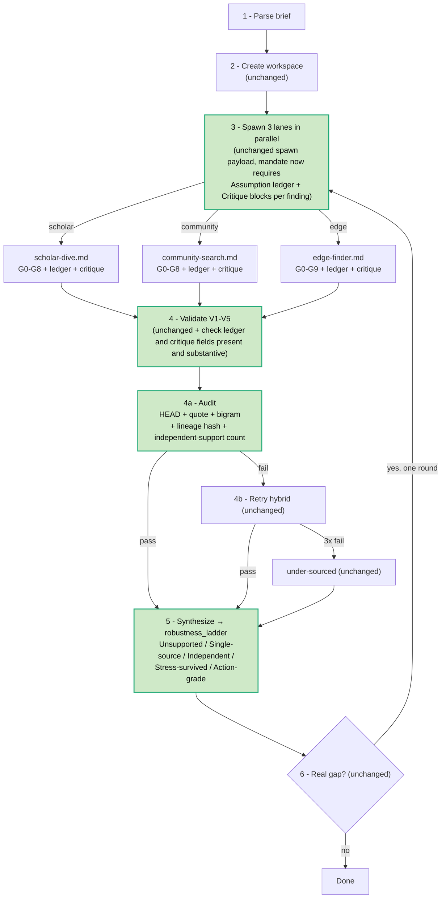

Parent: ARCHITECTURE.md
Supersedes: ./2026-05-19-variations-synthesis-plan-v2.md

# reTruth — Variations Synthesis & Improvement Plan v3

## Status

Replaces v2. User pushed back twice on complexity (first against the v1 kit-router, then against v2's 4-phase runtime restructure). This pass takes the user's instinct seriously and tests it: **is the original better?** Answer: largely yes. Most of what the variations propose is already covered by the existing G0–G9 lane gates + V1–V5 validation + verification audit. The genuinely additive, non-overlapping mechanisms reduce to four small surgical additions, ~50 lines total, no pipeline restructure.

## Scope

- Same source corpus as v2 (44 variations + 7 new v44–v50).
- Decision principle: an addition is justified only if it (a) preserves universality, (b) does not duplicate existing rigor in the gate/validation/audit stack, and (c) costs less in code-lines than it earns in answer quality the user can see.
- Out of scope this turn: editing any framework file. Awaiting user direction.

## Evidence

### What the original already does (full credit)

Before recommending any change, the existing surface needs to be acknowledged honestly:

| Original mechanism | Already covers |
|---|---|
| **G0 anti-hallucination prelude** (each lane) | Mechanical regex/range/lookup before any finding is written. |
| **G1 existence + G2 source-claim fidelity** | Findings must point to a stable URL and faithfully cite source. |
| **G3 CRAAP / authority signals** | Currency, relevance, authority, accuracy, purpose enforced per finding. |
| **G4 falsifiability** | Numeric/conditional/triple falsifier required. |
| **G5 triangulation** | ≤2 isolated findings per run; corroboration enforced. |
| **G6 anti-drift checkpoint** | Mid-run, every 3 findings, lane self-checks against brief. |
| **G7 domain-harm gate** | High-confidence required for safety-critical claims. |
| **G8 Socratic backstop** | Mechanism-coherence final check. |
| **G9 edge crank filter / anti-redundancy** | Edge-specific extra rigor. |
| **V1–V5 orchestrator validation** | File non-empty, ≥5 findings counting pivots, no "I cannot", verbatim quote per finding, Closing block present. |
| **Verification audit (Step 4a)** | HEAD-request each URL, curl + grep verbatim quote against page, edge-bigram overlap ≥30% vs combined scholar+community. |
| **Retry hybrid (Step 4b)** | Attempt 1 inline same turn; attempts 2–3 wait 5 min; after 3 fails → `under-sourced`. Bounded cost. |
| **Pivot procedure** | Floor 5 enforced; below floor → mechanism→adjacent topic, marked, capped at 5. |
| **Closing block requirements** | Top findings, tensions, pivots, mid-run corrections, interpretive choices, queries run audit trail, absences logged, known limitations, known gaps. |
| **4-thread cap + clean isolation** | Orchestrator never reads mandates; concurrency safe. |

**This is a lot of rigor.** Most of what v44–v50 propose to add is already enforced somewhere in this stack, just under different names.

### What v44–v50 actually adds beyond the existing stack (honest overlap audit)

| Variation | Claimed addition | Already covered by | Net addition |
|---|---|---|---|
| v44 retrieval_mesh | source-map pass surfaces missing zones first-class | Closing block "Absences logged" + "Known gaps" | Earlier surfacing (before extraction) — costs 3× spawn rounds for marginal earliness gain. **Low net.** |
| v45 checkpoint_cascade | phase-level retry | Retry hybrid bounded at 3 attempts | Saves work on late-stage failures only — but retry is already cost-bounded. **Low net.** |
| v46 evaluator_forge | metrics rubric, self-scoring | G0–G9 per-finding gates + V1–V5 lane validation | Adds a layer that mostly re-measures what gates already enforce. **Low net.** |
| v47 handoff_guardrail | named guardrails + compact contract per lane | V1–V5 numbered checks + full lane mandate as the contract | Naming the existing checks is mostly a relabeling. **Very low net.** |
| v48 memory_citation_spine | `memory/` + `spine/` with atomic citation nodes | Existing workspace files + verbatim quote per finding | Atomic nodes are nice for synthesis grounding but require restructuring lane outputs. **Medium net at high cost.** |
| v49 critique_revision_loop | per-finding self-critique before audit | G6 anti-drift fires every 3 findings; verification audit is post-hoc | Per-finding (vs every-3) self-critique is a real gap. **Genuine medium-net addition at small cost.** |
| v50 consensus_court | docket-driven adjudication synthesis | Closing block "Tensions and disagreements" + freeform Step 5 synthesis | Docket structure is real upgrade to freeform synthesis. **Medium net, medium cost.** |
| v14 assumption_ledger | per-finding "what must be true" field | Nothing equivalent in current gates | **Genuine high-net at tiny cost.** |
| v39 robustness_ladder | tiered synthesis output | Freeform synthesis | **Genuine high-net at small cost.** |
| v35 provenance_chain + v41 evidence_compression_index | lineage + independence count in audit | Bigram redundancy audit (Step 4a) | Extends existing audit with non-overlapping checks. **Genuine high-net at small cost.** |
| Other v1–v43 mechanisms | (per v1 plan analysis) | Mostly topic-specializing → rejected per user feedback | (rejected) |

### Net-additive, non-overlapping, low-cost mechanisms (the only ones worth adopting)

1. **`Assumption ledger:` field per finding** (v14) — no overlap with anything in original.
2. **`Critique:` field per finding** (v49 lite — `Strongest attack:` + `Revision action:` only, not the full critique-revision sub-pipeline) — fills the per-finding gap left by G6's every-3-findings cadence.
3. **`robustness_ladder` tiered synthesis output** (v39) — replaces freeform Step 5 with explicit tiers.
4. **`provenance lineage hash` + `independent-support count`** in Step 4a audit (v35 + v41) — extends bigram audit without replacing it.

Everything else from v44–v50 either duplicates existing rigor or restructures the pipeline for marginal gain.

## Three paths — pros / cons / recommendation

### Path 0 — Do nothing (keep original)

**Pros:**
- Zero risk, zero cognitive cost.
- Current pipeline already enforces deep rigor (15+ named checks across G-gates + V1–V5 + audit).
- 137-line orchestrator stays debuggable.
- No new files, no new concepts, no maintenance burden.

**Cons:**
- Hidden assumptions stay hidden (no ledger).
- Per-finding critique only happens at G6 (every 3 findings) — first 2 findings of each batch get no peer pressure.
- Synthesis output is freeform — reader can't see confidence tier at a glance.
- Echo inflation possible — bigram audit catches lane-vs-lane overlap but not within-lane shared root claims.

### Path 1 — Surgical additions (recommended)

**Adds the 4 net-additive mechanisms above. ~50 lines, 4 files, no pipeline restructure.**

**Pros:**
- Closes the 4 concrete gaps in original without restructuring anything.
- All 4 are additive fields/checks — every one independently revertable.
- No new spawn rounds, no new workspace dirs, no new concepts beyond what the lane mandate already enforces.
- Universal — every topic benefits.
- Fits in line caps with room to spare.
- Preserves the original's strength: simple, debuggable, flexible.

**Cons:**
- Skips genuinely interesting mechanisms (phase-level retry, source-map visibility, evaluator metrics, consensus docket) — but the cost-of-overlap audit shows they re-measure what's already enforced.
- If future telemetry reveals a gap these 4 don't close (e.g. lanes routinely waste budget on late-phase failures), Path 1 doesn't fix it — would require Path 2.

### Path 2 — v2 plan (full 4-phase restructure)

**Pros:**
- Catches every gap including marginal ones.
- Phase-level retry and source-map visibility are real wins on long runs.
- Memory/spine + consensus docket give synthesis a richer substrate.

**Cons:**
- ~225 lines net add; promotes SKILL.md to 500-line cap class or splits the file.
- Triples spawn rounds per lane (query-plan → retrieve → extract).
- Most additions duplicate existing G-gates or V1–V5 checks under different names.
- Higher cognitive cost — new concepts (checkpoints, handoff packets, metric rubric, docket).
- Pipeline restructure is irreversible without full rollback.

## Recommendation: **Path 1**

**Reason:** The original architecture is already disciplined enough that most v44–v50 mechanisms re-implement existing rigor under new names at higher cost. The four mechanisms that *don't* overlap address real gaps (hidden assumptions, per-finding critique cadence, freeform synthesis confidence, echo inflation) at trivial line cost. Path 1 takes those four wins and stops.

**Stay close to the original. Add only what fills a concrete, non-overlapping gap. Pay for restructure only when telemetry shows the existing mitigations failing.**

Path 2 stays available as a follow-up if real-run evidence shows G6's every-3-findings cadence or the whole-lane retry are actually losing material answer quality. But that case has to be made with data, not anticipated from a variation reading.

## Files touched (Path 1 only)

| File | Change | Lines | Cap | Headroom |
|---|---|---|---|---|
| `reTruth/skills/SKILL.md` | Step 4a audit gains 2 sub-checks (lineage hash, independent-support count). Step 5 synthesis output replaces freeform with 5-tier `robustness_ladder` format. | +25 | 200 | 137 → 38 headroom ✓ |
| `reTruth/skills/scholar-dive.md` | Finding format gains `Assumption ledger:` and `Critique:` (with `Strongest attack:` + `Revision action:`) blocks. | +8 | 500 | 322 → 170 headroom ✓ |
| `reTruth/skills/community-search.md` | Same two blocks. | +8 | 500 | 336 → 156 headroom ✓ |
| `reTruth/skills/edge-finder.md` | Same two blocks. | +8 | 500 | 342 → 150 headroom ✓ |
| audit hook bash script | Implements lineage hash + independence count. | (still unwritten per existing TODO) | — | — |

**Reversibility:** each of the four mechanisms reverts independently by deleting its lines/fields. No cascading changes.

## Risks

- **Per-finding critique can become a ritual line item** that lanes treat as paperwork. Mitigation: validation V-check rejects critique blocks where `Strongest attack:` equals "none" or is shorter than 5 words.
- **Robustness ladder tiers** depend on existing G3 CRAAP + G5 triangulation outputs — if those are stale or skipped, the ladder mis-tiers. Mitigation: ladder logic explicitly references which G-gate evidence promotes a claim to the next tier; orchestrator can refuse to tier a claim missing the required G-gate evidence.
- **Lineage hash collisions** (two genuinely independent claims with identical normalized text) are possible. Mitigation: independence count uses URL-host + DOI/ISBN/identifier first, falls back to text hash only when no identifier exists.
- **Audit hook bash script is still unwritten** — Path 1 inherits this TODO from the existing audit infrastructure; not regressed here.
- **No phase-level retry** — accept whole-lane retry cost; reconsider only if real runs show >20% of retries are losing pre-validated work.

## What this plan diagram looks like

Compared to the original: 4 boxes touched, no new boxes, no new edges, same 4-thread cap, same isolation. Diagram shape unchanged.

## Next

1. User confirms: Path 1 (recommended) or Path 0 (do nothing) or Path 2 (full v2 restructure).
2. If Path 1 confirmed, open a separate implementation session per CLAUDE.md report → action discipline. Order of work: lane mandates (smallest changes) → SKILL.md → audit hook script.
