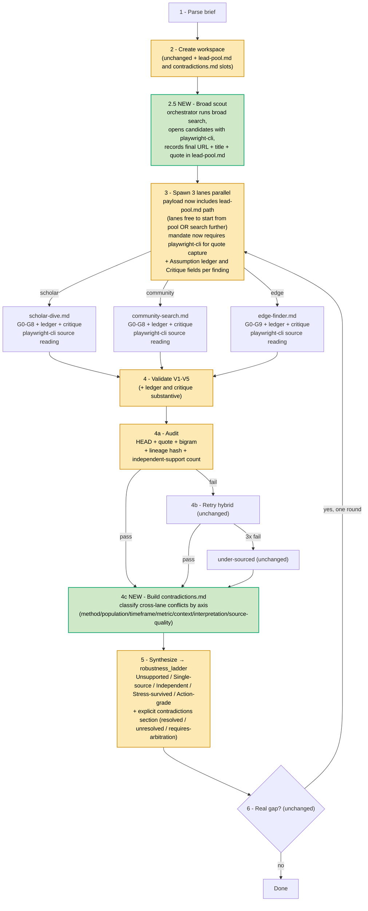

Parent: ARCHITECTURE.md
Supersedes: ./2026-05-19-variations-synthesis-plan-v3.md

# reTruth — Variations Synthesis & Improvement Plan v4

## Status

Replaces v3. 32 new variations (v51–v82) extend the corpus from 51 to 83 total. The new batch shifts the architectural signal: most v51–v82 mechanisms are **sequence changes** (pre-lane scout + post-lane reconciliation), not topic specializers. That re-opens a question v3 closed: the corpus is now telling us the *order of operations* in the original pipeline can be improved, even if the per-finding rigor (G0–G9 + V1–V5 + audit) does not need replacing. User has explicitly granted rewrite latitude this round — decisions still go through user before edits.

## Scope

- **Source read:** 83 variations (v1–v82, minus v81 numbering gap if any), plus the actual `reTruth/skills/gnosis/SKILL.md` (138 lines, not the `reTruth/gnosis/skills/SKILL.md` path documented in CLAUDE.md — path drift in CLAUDE.md that should be fixed when this plan ships).
- **Decision principle (preserved from v3):** an addition is justified only if it (a) preserves universality, (b) does not duplicate existing rigor, and (c) costs less in code-lines than it earns in answer quality. **New principle this round:** a sequence change is universally additive — it benefits every topic — and is not the same category as the topic-specializing kit-router that user previously rejected. Sequence changes are not specializers.
- **Out of scope:** editing any framework file. Awaiting user direction.

## Evidence

### What's new in v51–v82 — the structural signal

Reading 32 new variation pipelines side-by-side reveals one dominant pattern, not many novel mechanisms:

**Pre-lane shared scout → ledger/matrix → lanes resolve cells → matrix reconciliation → synthesize.**

Concrete examples of the same pattern across many names:

| Variation | What it inserts before lane fan-out | What it inserts before synthesis |
|---|---|---|
| **search_prior_matrix (v62)** | broad scout → `prior-matrix.md` of claim seeds | route cells to lanes; lanes may add cells |
| **source_reading_lattice (v63)** | open candidates with `playwright-cli` → `source-ledger.md` | lanes cite ledger IDs |
| **coverage_map_planner (v53)** | coverage schema → lane-specific grid | coverage proven before synthesis |
| **query_route_lattice (v55)** | question structure visible before retrieval | source-route precision |
| **information_scent_router (v65)** | leads scored by scent/corroboration/cost → `scent-ledger.md` | route high-method to scholar etc. |
| **query_berrypicking_router (v66)** | query evolution from browser-read text → `berry-ledger.md` | lanes cite berry-ledger IDs |
| **lateral_verification_loop (v68)** | SIFT lateral check → `lateral-ledger.md` | lanes use only `pass` leads |
| **triangulation_confidence_matrix (v69)** | claim confidence matrix from cross-source corroboration | claims classified robust/supported/fragile/exploratory/drop |
| **contradiction_reconciliation_matrix (v70)** | (lane work then) `contradiction-matrix.md` | conflicts routed back or preserved |
| **citation_chaining_lattice (v71)** | strong seeds → backward/forward/sibling chains | route chain outputs by lane |
| **search_provenance_spine (v72)** | provenance spine of search actions | reproducible path before synthesis |
| **saturation_stop_rule (v73)** | saturation ledger by round | stop decisions made on ledger state |
| **incentive_bias_ledger (v74)** | `incentive-ledger.md` of source funding/disclosure | source weighting before synthesis |
| **evidence_freshness_clock (v75)** | `freshness-clock.md` of dates + decay risk | freshness-weighted synthesis |
| **double_diamond_grounding (v76)** | discover/define/develop/deliver ledger | grounded options only |
| **need_to_knowledge_broker (v77)** | NtK ledger gates before lane synthesis | only source-backed needs survive |
| **after_action_learning_loop (v78)** | `aar-ledger.md` of intended vs actual outcomes | post-run learning artifact |
| **premortem_failure_oracle (v79)** | `premortem-ledger.md` before convergence | failure modes searched before recommendation |
| **assumption_testing_matrix (v80)** | `assumption-ledger.md` before convergence | assumptions routed to lanes for test |
| **context_domain_router (v81)** | `domain-ledger.md` (clear/complicated/complex/chaotic) | response matched to domain |
| **problem_decomposition_ladder (v82)** | `problem-ladder.md` (why/how moves) | search from grounded branches not user phrasing |

**The pattern repeats across 22+ of 32 new variations.** Each one re-invents the ledger format but the structure is the same: **separate broad retrieval from lane interpretation; explicit reconciliation before synthesis.** The corpus has converged.

Three concrete substrate consequences emerge from the convergence:

1. **`playwright-cli` for source reading.** v63, v65, v66, v67, v68, v71–v82 all open candidates with `playwright-cli` and record final URL + visible quote in a shared ledger before lane work. CLAUDE.md already authorizes the tool; current SKILL.md does not require it. Snippet-based quotes (current WebSearch/WebFetch behavior) are weaker than browser-read quotes.
2. **Shared scout pass.** A broad shallow retrieval before lane fan-out produces a shared lead-pool. Lanes interpret a known set instead of each constructing one. Cuts duplicate work; surfaces coverage geometry early.
3. **Explicit reconciliation matrix.** Cross-lane conflict surfacing before synthesis. Replaces the freeform "Tensions" section that gets buried in the synthesis prose.

### Is the original better? Re-tested per category

Per user feedback (saved as `feedback_original_better_check.md`), the bias is "favor flexibility-preserving additions over architecture-specializing ones." Each candidate from the new corpus is tested against this bar individually.

| Candidate addition | Original-better? | Reason |
|---|---|---|
| Mode-kit router (v1 plan) — 6 topic kits | **Original better** | Partitions topics, sacrifices universality. Already rejected. |
| Phase-level retry (v2 plan, v45) | **Original better** | Existing retry-hybrid is bounded at 3 attempts. JSONL machinery costs more than it saves. |
| Evaluator metric rubric (v2 plan, v46) | **Original better** | Duplicates G0–G9 + V1–V5 enforcement at higher cost. |
| Handoff packet (v2 plan, v47) | **Original better** | Lane mandate IS the contract; renaming numbered checks adds nothing. |
| Memory/spine workspace (v2 plan, v48) | **Original better** for atom-grain; **new pattern better** for shared scout ledger. |
| Per-finding critique (v3 plan, v49) | **New mechanism wins, tiny cost** | G6 fires every-3-findings; per-finding fills the gap. 4 lines per lane. |
| Assumption ledger field (v3 plan, v14) | **New mechanism wins, tiny cost** | No equivalent in current gates. |
| Robustness ladder synthesis (v3 plan, v39) | **New mechanism wins, small cost** | Replaces freeform synthesis with tiers. |
| Lineage + independence audit (v3 plan, v35+v41) | **New mechanism wins, small cost** | Extends bigram audit without replacing. |
| **`playwright-cli` for quote capture (NEW from v51–v82)** | **New mechanism wins** | Browser-read quotes are higher fidelity than snippet quotes. Already authorized by CLAUDE.md. ~10 lines per lane to require it. |
| **Shared prior-matrix scout (NEW from v62)** | **New mechanism wins, moderate cost** | Cuts duplicate lane retrieval, surfaces coverage geometry, separates retrieval from interpretation. Adds one orchestrator step. Lanes still free-search from a richer starting point. |
| **Contradiction reconciliation matrix (NEW from v70)** | **New mechanism wins, small cost** | Surfaces cross-lane conflicts explicitly before synthesis. Replaces buried freeform "Tensions". |
| Saturation stop rule (v73) | **Original better** | Existing volume floor 5 + ceiling already enforce stop. Saturation ledger is bookkeeping overhead. |
| Incentive ledger (v74) | **Mode-conditional, not universal** | Useful for funded/policy topics, not general. Rejected per anti-specializer rule. |
| Freshness clock (v75) | **Original mostly better; signal_decay_tracker field cheaper** | A `Freshness:` tag per finding captures 80% at 5% cost. |
| Context-domain router (v81, Cynefin) | **Original better** | Topic specializer; rejected per anti-specializer rule. |
| Problem decomposition ladder (v82) | **Original better** | Lane mandates' brief-parse + G6 anti-drift already cover this. |
| After-action learning loop (v78) | **Mode-conditional** | Useful if cross-run learning is enabled; ties to deferred `memory_loom`. Defer. |
| Pre-mortem (v79) | **Mode-conditional** | Useful for decision recommendations; covered by Path 1's critique field for general use. |

**Net: the v51–v82 corpus adds three universal mechanisms not already in v3's Path 1.** Everything else either overlaps existing rigor, specializes for a topic class, or duplicates v3 Path 1 picks under a different name.

## Four paths (numbered consistently with prior plans)

### Path 0 — Do nothing (keep original)

Same as v3 Path 0. Zero risk, zero cognitive cost. Cons: 4 concrete gaps (assumption visibility, per-finding critique cadence, freeform synthesis confidence, echo-source detection) + 3 new gaps from v51–v82 corpus (snippet-quote fidelity, duplicate lane retrieval, freeform cross-lane tension surfacing).

### Path 1 — Surgical additions only (v3 recommendation, unchanged)

Same as v3 Path 1. ~50 lines, 4 files, no pipeline restructure. Closes 4 gaps:

1. `Assumption ledger:` field per finding (each lane mandate)
2. `Critique:` field per finding (each lane mandate)
3. `robustness_ladder` synthesis output format (SKILL.md Step 5)
4. provenance lineage hash + independent-support count (SKILL.md Step 4a audit)

### Path 1+ — Path 1 plus the three universal mechanisms from v51–v82 (NEW recommendation)

Adds three sequence/substrate changes to Path 1. Total ~110 lines net. Still no topic branching. Lanes keep free-search authority.

**Additions on top of Path 1:**

**5. `playwright-cli` mandatory for quote capture (lane mandates).**

Each lane's source-reading step changes from `WebSearch + WebFetch` to: search returns candidates → open each candidate with `playwright-cli` → record final URL + visible page quote in the lane's finding before assignment to G-gates. The G2 source-claim fidelity gate stays; quote-grep audit at Step 4a stays. The change is: quote is verified at capture time, not just at audit time, and it comes from the actually-rendered page, not a snippet. ~8 lines per lane mandate.

**6. Shared `lead-pool.md` scout pass before lane spawn (SKILL.md Step 2.5).**

New orchestrator step inserted between workspace creation and lane spawn. Orchestrator runs a broad shallow web search using the brief's keywords; opens top candidates with `playwright-cli`; records final URL + title + 1-quote per candidate in `<workspace>/lead-pool.md`. No interpretation — only collection. Then spawns lanes; spawn payload now includes the `lead-pool.md` path. Lanes are *encouraged* to start from the lead-pool but free to search further. ~25 lines in SKILL.md.

This is critical to spell out: **lanes are not constrained to lead-pool cells.** They can ignore the lead-pool. The lead-pool is a shared starting context, not a routing assignment. This preserves the original's flexibility (lanes retain full search authority) while cutting duplicate retrieval and surfacing coverage geometry early.

**7. `contradictions.md` matrix between Step 4 validate and Step 5 synthesize.**

After V1–V5 pass and Step 4a audit, orchestrator does a small pre-synthesis pass: identify findings that conflict across lanes (e.g. scholar says X, community says not-X for same topic). Classify each conflict by axis (method / population / timeframe / metric / context / interpretation / source-quality). Write `<workspace>/contradictions.md`. Synthesis Step 5 then explicitly addresses each contradiction (resolved / unresolved / requires-arbitration). ~20 lines in SKILL.md.

This replaces the buried "Tensions" section in current freeform synthesis with a structured pre-synthesis step that the user can read independently.

### Path 2 — Full corpus-pattern restructure

Adopt the corpus pattern fully: broad scout → ledger → lanes resolve assigned cells (not free-search) → matrix reconcile → synthesize. ~250 lines net. Lanes lose free-search authority; orchestrator does most retrieval. Higher cognitive cost. Most v51–v82 ledgers added one at a time.

**Rejected** for the same reasons v2 was rejected: too much bookkeeping, lanes lose creative flexibility (especially Edge), most ledgers (saturation, incentive, freshness as separate files, NtK, AAR, premortem, problem-ladder, domain-ledger) are mode-conditional and over-instrument the general pipeline. Plus several individual variations in v51–v82 explicitly flag the same risks ("over-document absences and slow synthesis", "false precision if tiers look more objective than they are", "shared ledger may reduce lane independence", "branch explosion if every term becomes a query").

## Recommendation: Path 1+

**Reason:** Path 1+ captures the structural insight from the v51–v82 corpus without sacrificing lane flexibility, without specializing for topic class, and without restructuring the per-finding G-gate stack that the original gets right. Each addition is independently revertible. Each addresses a concrete gap. None of them constrains future runs to a topic class.

The user's "is the original better?" heuristic still applies: it correctly rejected the kit-router, the phase-level retry, the evaluator rubric, the handoff packet, the topic-class context router, and the various mode-conditional ledgers (incentive, freshness-as-file, NtK, AAR, premortem-as-step, problem-ladder, domain-ledger, saturation). It does *not* reject the three Path 1+ additions because they preserve flexibility (lanes still free-search), they don't partition topics, and they fix concrete gaps original cannot reach by adjusting per-finding rigor alone.

## Pros / Cons / Cost table

| Path | Lines added | Files changed | Pipeline restructure | Specializer? | Closes assumption gap | Closes critique-cadence gap | Closes freeform-synthesis gap | Closes echo-source gap | Closes snippet-quote gap | Closes duplicate-retrieval gap | Closes tension-surfacing gap |
|---|---|---|---|---|---|---|---|---|---|---|---|
| **0** Do nothing | 0 | 0 | No | No | ✗ | ✗ | ✗ | ✗ | ✗ | ✗ | ✗ |
| **1** Surgical | ~50 | 4 | No | No | ✓ | ✓ | ✓ | ✓ | ✗ | ✗ | ✗ |
| **1+** Surgical + 3 sequence (recommended) | ~110 | 4 | Light (1 new step + 1 reconcile step) | No | ✓ | ✓ | ✓ | ✓ | ✓ | ✓ | ✓ |
| **2** Full corpus pattern | ~250 | 4 + new ledger files | Heavy (lanes lose free-search) | No, but mode-flavors | ✓ | ✓ | ✓ | ✓ | ✓ | ✓ | ✓ |

## Concrete file changes for Path 1+

| File | Change | Lines | Cap | Headroom |
|---|---|---|---|---|
| `reTruth/skills/gnosis/SKILL.md` | (a) Step 4a audit: lineage hash + independent-support count. (b) Step 5 synthesis: replace freeform with `robustness_ladder` tiers. (c) Step 2.5 NEW: broad scout → `lead-pool.md`. (d) Step 4c NEW: build `contradictions.md` between validate and synthesize. (e) Step 3 spawn payload now includes `lead-pool.md` path. | +75 | 200 | 138 → -13 → over by 13. Needs 50-line cap exception or split. |
| `reTruth/skills/gnosis/scholar-dive.md` | (a) `Assumption ledger:` field. (b) `Critique:` field (Strongest attack + Revision action). (c) Source-reading step mandates `playwright-cli`. | +16 | 500 | OK |
| `reTruth/skills/gnosis/community-search.md` | Same three additions. | +16 | 500 | OK |
| `reTruth/skills/gnosis/edge-finder.md` | Same three additions. | +16 | 500 | OK |
| audit hook bash script | Implements lineage hash + independence count (still TODO from existing audit infrastructure). | (existing TODO) | — | — |
| `CLAUDE.md` Repository map | Fix path drift (`reTruth/gnosis/skills/` → `reTruth/skills/gnosis/`). Add `lead-pool.md` and `contradictions.md` to workspace files list. | +3 | 200 | OK |

**SKILL.md overflow:** at +75 lines on a 138-line file, SKILL.md becomes 213 lines — 13 over the 200-line cap. Two options:

- **A.** Promote `SKILL.md` to a documented 250-line cap (looser than the 500-line lane-mandate exception, tighter than no cap). Justified because orchestrator spec is becoming denser. Recommend **A**.
- **B.** Split into `SKILL.md` (pipeline) + `SKILL-synthesis.md` (Step 4a + 4c + 5). Both stay under 200. Adds one file to maintain.

## What Path 1+ pipeline looks like

**Sequence change vs original:** two new boxes (2.5 scout, 4c contradictions). Lane behavior modified (playwright-cli quote + ledger + critique fields) but lane authority preserved (still free-search, still own their output files, still gated by G0–G9). Same 4-thread cap during lane phase. Scout phase is single-thread orchestrator work; contradictions is single-thread orchestrator work.

## Risks specific to Path 1+

- **Scout adds wall-clock.** Broad scout is one extra orchestrator step before parallel lane work. Estimate: 30–90 seconds added. Mitigation: cap scout candidates at N=20; cap per-candidate playwright-cli at single page-load with 10-second timeout.
- **Lead-pool can bias lanes.** Lanes see the same starting context. Mitigation: spawn prompt explicitly says lead-pool is non-mandatory; Edge lane in particular is instructed to add ≥1 candidate not in lead-pool (preserve Edge's anti-redundancy + structural-edge mandate).
- **`playwright-cli` failures on protected sites.** Some pages block automation. Mitigation: lane mandate explicitly allows fallback to `WebFetch` when `playwright-cli` returns an automation-blocked status, recording the fallback in the finding's source notes.
- **Contradictions matrix can over-identify.** Two findings with same wording can be flagged as conflicts when they merely use opposite framing of the same fact. Mitigation: contradictions.md classification step explicitly distinguishes "framing conflict" (drop) from "evidence conflict" (keep).
- **SKILL.md cap promotion** requires a documented exception, similar to the lane-mandate 500-line exception. Recommend documenting it in CLAUDE.md next to the existing 500-line note.

## Risks deliberately accepted (not in Path 1+)

- **Saturation stop rule (v73), incentive ledger (v74), freshness-clock as separate file (v75), NtK broker (v77), AAR loop (v78), premortem as step (v79), problem-ladder (v82), Cynefin domain router (v81)** — all mode-conditional. Adding them as always-on adds bookkeeping for topics that don't need it. Adding them as kits re-introduces the topic-class specializer pattern that user rejected. Path 1+ keeps these available as future opt-in additions but does not commit to them now.
- **Phase-level retry (v45), evaluator rubric (v46), handoff packet (v47), memory/spine workspace (v48)** — already audited as duplicating existing rigor in v3 plan; conclusion unchanged.

## Decision points for user

1. **Approve Path 1+ direction**, or step back to Path 1, or push to Path 2 (rewrite). Default recommendation: Path 1+.
2. **SKILL.md cap:** option A (promote to 250-line cap, document exception) or option B (split into two files). Default recommendation: A.
3. **Lead-pool size cap:** start N=20 candidates with 10-second per-candidate playwright-cli timeout, total scout budget ≤3 minutes. Confirm or adjust.
4. **CLAUDE.md path fix:** mention drift now exists (`reTruth/gnosis/skills/` in CLAUDE.md vs actual `reTruth/skills/gnosis/`). Confirm fix is in scope for the same change set or deferred.
5. **Phasing or single PR:** Path 1+ is small enough to ship as one PR, but can be phased as (i) lane mandate additions (assumption_ledger + critique + playwright-cli) → (ii) SKILL.md scout + audit + synthesis → (iii) contradictions matrix. Each phase independently revertible.

## Decisions locked (2026-05-19, user-confirmed)

1. **Path 1+** confirmed.
2. **SKILL.md cap option B** confirmed — split `SKILL.md` into `SKILL.md` (pipeline) + `SKILL-synthesis.md` (Step 4a audit + Step 4c contradictions + Step 5 synthesis). Both stay under the existing 200-line cap. CLAUDE.md repository map updated accordingly.
3. **Scout budget** (Claude's choice, recorded for execution):
   - **N = 20 candidates** maximum opened per scout pass.
   - **Per-candidate `playwright-cli` timeout = 10 seconds** (page-load only; no interactive wait).
   - **Total scout wall-clock budget ≤ 3 minutes.** If budget exhausts before N candidates open, stop opening; record `<workspace>/lead-pool.md` with whatever opened. Lanes proceed with partial pool.
   - **Per-candidate fallback:** automation-blocked or timeout → record candidate with `status: blocked` and skip to next. Lane mandate already allows `WebFetch` fallback for blocked sources during the lane phase.
   - **Edge lane anti-redundancy preserved:** Edge spawn payload explicitly requires ≥1 candidate added by the lane itself, not from the lead-pool. Edge's existing G9 anti-redundancy + structural-edge mandate stays authoritative.
4. **CLAUDE.md path-drift fix** in same change set: `reTruth/gnosis/skills/SKILL.md` → `reTruth/skills/gnosis/SKILL.md`. New files (`SKILL-synthesis.md`, `lead-pool.md`, `contradictions.md`) added to Repository map row.
5. **Phasing** (Claude's choice, recorded for execution): **3 phases**, each shippable independently as its own commit per CLAUDE.md "commit every turn".

### Phase plan

| Phase | Scope | Files touched | Net lines | Independently shippable? |
|---|---|---|---|---|
| **P1 — Lane field additions** | Add `Assumption ledger:` + `Critique: (Strongest attack + Revision action):` fields to each lane mandate's finding format. Add `playwright-cli` requirement to each lane's source-reading step (with `WebFetch` fallback for blocked sources). Update each lane's QA checklist to validate the new fields are substantive. | `scholar-dive.md`, `community-search.md`, `edge-finder.md` | ~48 (3 × ~16) | **Yes** — original SKILL.md works with the new fields immediately; audit + synthesis sections see new fields as informational. |
| **P2 — SKILL.md split + audit/synthesis upgrades** | Split `SKILL.md` into `SKILL.md` (Steps 1, 2, 3, 4, 4b, 6 + Skip/Constraints) and `SKILL-synthesis.md` (Step 4a audit, Step 4c contradictions stub, Step 5 synthesis). Add lineage hash + independent-support count to Step 4a. Replace freeform Step 5 with `robustness_ladder` tier output. Update CLAUDE.md repository map: fix path drift + add `SKILL-synthesis.md` row. | `SKILL.md`, new `SKILL-synthesis.md`, `CLAUDE.md` | ~50 net | **Yes** — Phase 1 fields are now consumed by ladder synthesis + lineage audit. Path-drift fixed. |
| **P3 — Scout + contradictions matrix** | Add Step 2.5 (`lead-pool.md` scout via `playwright-cli` with N=20 / 10s / 3min budget). Update Step 3 spawn payload to include `lead-pool.md` path. Add Step 4c (`contradictions.md` matrix with classification by axis) in `SKILL-synthesis.md`. Update Step 5 synthesis to consume `contradictions.md`. Update Repository map: add `lead-pool.md` + `contradictions.md` to workspace files row. | `SKILL.md`, `SKILL-synthesis.md`, `CLAUDE.md` | ~60 net | **Yes** — final shape of Path 1+. If P3 doesn't pan out on real runs, P1+P2 still deliver 4/7 closed gaps. |

**Reason for 3 phases (not single PR):**
- **Aligns with user's bias against complexity.** Each phase is one orthogonal improvement; if P3 fails on real runs, P1+P2 still ship.
- **Each phase has independent reverse path.** P3 revertible by deleting Step 2.5 + Step 4c. P2 revertible by merging files back. P1 revertible by removing fields.
- **Each phase has independent validation signal.** P1: do lanes produce useful Assumption/Critique fields? P2: do users find robustness_ladder synthesis clearer than freeform? P3: does scout cut duplicate retrieval without biasing lanes?
- **CLAUDE.md path drift fix lands in P2** — the SKILL.md split is the natural moment to touch CLAUDE.md.

## Next

1. Open separate implementation session per CLAUDE.md report → action discipline.
2. Execute **P1** first (smallest, lowest risk). Single commit at end of P1.
3. After P1 lands, run one real-world `/gnosis <topic>` to confirm the new fields are populated meaningfully before starting P2.
4. P2 → real-run check → P3 → real-run check.
5. Plan v4 (this file) is the source of truth for the change set across all 3 phases. Supersede with v5 only if real-run evidence requires plan revision.
